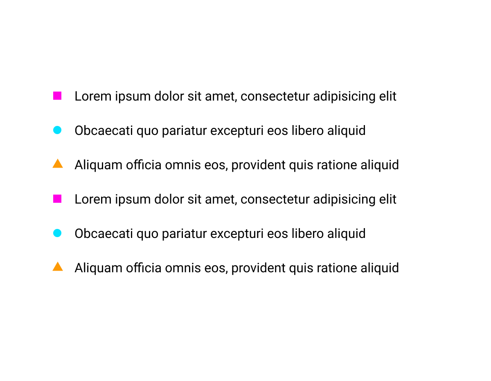

# Fancy list

Follow the example image to create a fancy list:

* [] Use the right HTML elements for the job
* [] There are 3 shapes: circle, square, and triangle
* [] Find the pattern in the list shapes
